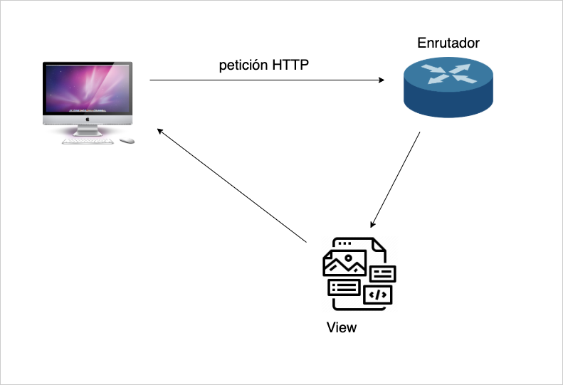

# Ciclo de peticiones en Laravel

> El punto de entrada de todas y cada una de nuestras peticiones es el enrutador. 

## ¿qué es el enrutador?

> Es una clase que recibe y procesa peticiones 

    Route::get('petición', acción);

